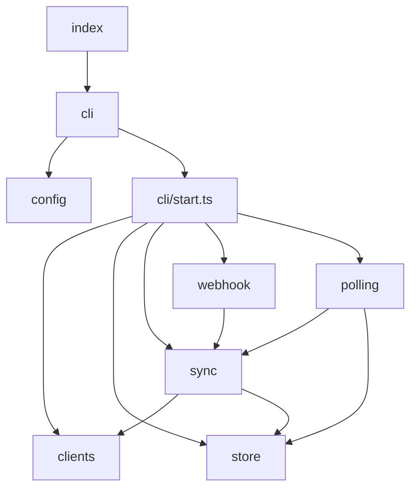

# WSync — Architecture

Overview of the module structure, responsibilities, and data flow.

---

## Module Map

```
src/
├── index.ts           # Entry point — parses argv and delegates to the CLI
├── constants.ts       # App-wide constants (name, version, PID path, etc.)
├── cli/               # Command dispatch (start, status, stop)
├── config/            # Config loading, validation, defaults, and schema types
├── clients/           # HTTP clients for Clockify and Jira
├── sync/              # Core sync logic (orchestration, filtering, mapping)
├── webhook/           # HTTP server for Clockify webhook events
├── polling/           # Periodic poller
├── store/             # SQLite persistence
└── logger/            # Structured console logger
```

---

## Module Responsibilities

### `index.ts`

Minimal entry point. Slices `process.argv` and calls `runCli()`. Contains no business logic.

### `constants.ts`

Single source of truth for values referenced across multiple modules: `APP_NAME`, `APP_VERSION`, `APP_DESCRIPTION`, `JIRA_PROPERTY_KEY`,
`PID_FILE`, `DEFAULT_PORT`. Modules import from here rather than hardcoding values.

### `cli/`

| File        | Responsibility                                                                                |
|-------------|-----------------------------------------------------------------------------------------------|
| `index.ts`  | Parses CLI arguments, loads config, routes to the correct command handler                     |
| `start.ts`  | `start` command — initializes all services, manages the PID file, registers shutdown handlers |
| `status.ts` | `status` command — reads the PID file and recent DB records, prints a summary                 |

### `config/`

| File          | Responsibility                                                                                         |
|---------------|--------------------------------------------------------------------------------------------------------|
| `schema.ts`   | TypeScript interfaces for the `AppConfig` structure                                                    |
| `defaults.ts` | Default values for optional fields, merged before validation                                           |
| `loader.ts`   | Reads `config.json`, deep-merges with defaults, validates required fields, returns a typed `AppConfig` |

Config is loaded once at startup and injected into each service. No module reads `config.json` directly.

### `clients/`

Thin HTTP wrappers. Each client owns its base URL, authentication headers, and error handling. Clients have no awareness of sync logic.

| Client           | Methods                                                                              |
|------------------|--------------------------------------------------------------------------------------|
| `ClockifyClient` | `getCurrentUser()`, `getTimeEntries()`, `getTask()`                                  |
| `JiraClient`     | `getMyself()`, `getIssue()`, `addWorklog()`, `getWorklogs()`, `getWorklogProperty()` |

### `sync/`

The core domain. Stateless functions plus the orchestrating class.

| File           | Responsibility                                                                     |
|----------------|------------------------------------------------------------------------------------|
| `engine.ts`    | `SyncEngine` class — orchestrates the 8-step sync flow for a single time entry     |
| `extractor.ts` | Extracts a Jira issue key from a task name or entry description via regex          |
| `filter.ts`    | Determines whether an entry should be synced based on metadata and blacklist rules |
| `mapper.ts`    | Builds the Jira worklog API payload from a Clockify time entry                     |

`SyncEngine` is the only consumer of `extractor`, `filter`, and `mapper`. Both the webhook router and the poller call
`engine.syncTimeEntry()`.

### `webhook/`

| File        | Responsibility                                                                                      |
|-------------|-----------------------------------------------------------------------------------------------------|
| `server.ts` | `Bun.serve` HTTP server. Exposes `POST /webhook/clockify` and `GET /health`                         |
| `verify.ts` | HMAC-SHA256 signature verification against the configured webhook secret                            |
| `router.ts` | Parses the webhook body, validates the event type (`TIMER_STOPPED`), calls `engine.syncTimeEntry()` |

The server returns a response to Clockify immediately and processes the sync asynchronously.

### `polling/`

Runs a `setInterval` every `polling.intervalMinutes` minutes. On each tick:

1. Reads `getLastSyncedTimestamp()` from the store to determine the search window.
2. Fetches completed entries from Clockify.
3. Calls `engine.syncTimeEntry()` for each entry.
4. Logs a cycle summary: `N checked, X synced, Y skipped, Z failed`.

The first tick is delayed 30 seconds after startup.

### `store/`

| File                 | Responsibility                                                                                                                                   |
|----------------------|--------------------------------------------------------------------------------------------------------------------------------------------------|
| `database.ts`        | Opens the SQLite connection via `bun:sqlite`, creates the `sync_records` table if absent, exposes `getDatabase()`                                |
| `sync-repository.ts` | CRUD operations on `sync_records`: `findByClockifyEntryId`, `createSyncRecord`, `updateSyncStatus`, `getRecentRecords`, `getLastSyncedTimestamp` |

The database is initialized once in the `start` command and closed on shutdown.

**`sync_records` schema:**

| Column              | Type        | Description                                      |
|---------------------|-------------|--------------------------------------------------|
| `id`                | INTEGER PK  | Auto-increment                                   |
| `clockify_entry_id` | TEXT UNIQUE | Clockify time entry ID                           |
| `jira_issue_key`    | TEXT        | Jira issue key (e.g., `MPO-4986`)                |
| `jira_worklog_id`   | TEXT        | ID of the created Jira worklog                   |
| `duration_seconds`  | INTEGER     | Duration in seconds                              |
| `started_at`        | TEXT        | Entry start timestamp (ISO 8601)                 |
| `synced_at`         | TEXT        | Timestamp of the sync operation                  |
| `status`            | TEXT        | `success`, `skipped`, `failed`, or `blacklisted` |
| `error_message`     | TEXT        | Error detail, if applicable                      |
| `source`            | TEXT        | `webhook` or `polling`                           |

### `logger/`

Wrapper over `console` that prepends a timestamp, log level (`INFO`, `WARN`, `ERROR`, `DEBUG`), and a context tag (e.g., `[APP]`, `[POLL]`,
`[WEBHOOK]`). Debug output is suppressed unless `--debug` is passed at startup.

---

## Dependency Graph



All modules may import from `constants.ts` and `logger/`. No module imports from `cli/`.

---

## Data Flow

```
          +-------------------------------------------+
          |             Clockify API                  |
          +------+---------------------------+--------+
                 | webhook POST              | polling GET
                 v                           v
          webhook/server.ts           polling/poller.ts
                 |                           |
                 +-----------+---------------+
                             | syncTimeEntry(entry, source)
                             v
                      sync/engine.ts
          +-------------------------------------------+
          | 1. Check local DB (dedup)                 |
          | 2. Resolve Clockify task                  |
          | 3. Extract Jira issue key                 |
          | 4. Apply filters and blacklist            |
          | 5. Validate issue in Jira                 |
          | 6. Check Jira worklog props (dedup)       |
          | 7. POST worklog to Jira                   |
          | 8. Write sync_record to DB                |
          +-------------------------------------------+
                             |
                 +-----------+---------------+
                 v                           v
             Jira API                store/db (SQLite)
```

For the step-by-step breakdown, see [sync-flow.md](sync-flow.md).

---

## Design Decisions

**Config is loaded once and injected.** No module accesses `config.json` at runtime. The startup sequence is explicit and the config object
is the single source of runtime values.

**Deduplication is layered.** The local SQLite database is a fast-path check. Jira worklog properties are the durable source of truth. If
the database is lost, the Jira check prevents duplicate worklogs. See [sync-flow.md, Step 6](sync-flow.md) for details.

**Webhook responses are immediate; sync is asynchronous.** Clockify expects a fast HTTP response. The router calls `syncTimeEntry()` without
awaiting it and returns `{ received: true }` immediately.

**Task metadata is cached per polling cycle.** `SyncEngine` maintains a `Map<string, ClockifyTask>` so that multiple entries assigned to the
same task do not trigger redundant API calls within a single cycle.

**PID file prevents duplicate processes.** The file is written to `./data/wsync.pid` on startup and removed on shutdown. If the file exists
at startup, a warning is logged but execution continues.
