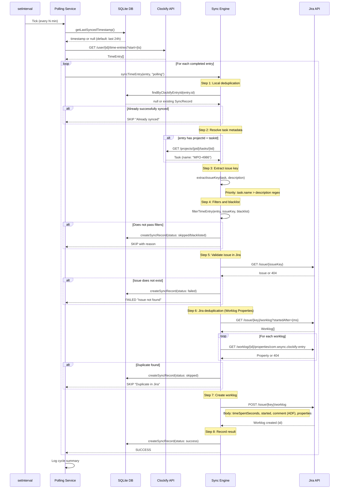
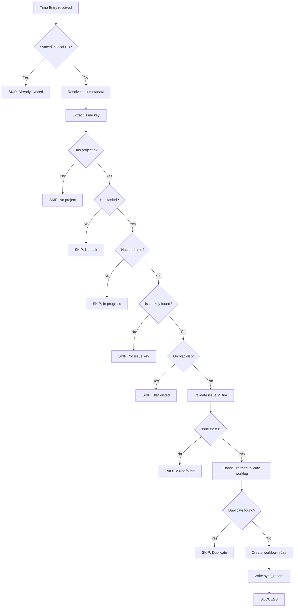

# WSync — Synchronization Flow

Technical reference for the synchronization process from Clockify time entries to Jira worklogs.

---

## Overview

WSync operates in **polling** mode by default: every N minutes it queries the Clockify API for recently completed time entries and creates corresponding worklogs in Jira. Webhook mode is available as an optional real-time trigger.

---

## Sequence Diagram — Polling Flow



---

## Step Details

### Step 1: Local Deduplication (SQLite)

The local database is queried before any external API call:

```sql
SELECT * FROM sync_records WHERE clockify_entry_id = ?
```

If a record with `status = 'success'` exists, the entry is skipped immediately. This is the fast-path deduplication check.

For the `sync_records` schema, see [architecture.md](architecture.md).

---

### Step 2: Resolve Task Metadata

If the entry has both `projectId` and `taskId`, the Clockify API is queried for the task:

```
GET /api/v1/workspaces/{wid}/projects/{pid}/tasks/{tid}
```

Response:

```json
{
    "id": "6a021225277e80bfd75bee39",
    "name": "MPO-4986",
    "projectId": "68b72e973a58446e827f86c8"
}
```

The `name` field holds the Jira issue key when the task was created via the Jira plugin for Clockify.

Task results are cached in memory (`Map<string, ClockifyTask>`) for the duration of the polling cycle to avoid repeated API calls.

---

### Step 3: Extract Issue Key

The issue key is extracted from one of two sources, evaluated in order:

1. **Task name (primary):** Regex `[A-Z][A-Z0-9]+-\d+` applied to `task.name`.
2. **Entry description (fallback):** Same regex applied to `entry.description`.

Example description:

```
[MPO-4986]: Set up local environment
```

The regex captures `MPO-4986`.

---

### Step 4: Filters and Blacklist

The following conditions are evaluated in order. A failed check skips the entry and records the reason.

| Condition | Outcome on failure | Log level |
|---|---|---|
| `entry.projectId` is set | SKIP | warn |
| `entry.taskId` is set | SKIP | warn |
| `entry.timeInterval.end` is set | SKIP (timer still running) | info |
| Issue key was extracted | SKIP | warn |
| `issueKey` not in `blacklist.jiraKeys` | SKIP (blacklisted) | info |
| `projectId` not in `blacklist.clockifyProjectIds` | SKIP (blacklisted) | info |
| `taskId` not in `blacklist.clockifyTaskIds` | SKIP (blacklisted) | info |

---

### Step 5: Validate Issue in Jira

The issue is verified to exist before the worklog is created:

```
GET /rest/api/3/issue/{issueKey}?fields=summary,status,project
```

A 404 response records the entry as `failed` with the message `"Issue not found in Jira"`. The `summary` field from a successful response is used as part of the worklog comment.

---

### Step 6: Jira Deduplication (Worklog Properties)

Existing worklogs for the issue are fetched:

```
GET /rest/api/3/issue/{key}/worklog?startedAfter={timestamp}
```

For each worklog, a custom property is checked:

```
GET /rest/api/3/issue/{key}/worklog/{worklogId}/properties/com.wsync.clockify-entry
```

Property structure:

```json
{
    "key": "com.wsync.clockify-entry",
    "value": {
        "clockifyEntryId": "6a0261cff0dbc41f787a2a4d",
        "syncedAt": "2026-05-12T01:46:35.831Z",
        "source": "polling"
    }
}
```

If `clockifyEntryId` matches the current entry, the entry is skipped.

This second deduplication layer ensures correctness even if the local database is lost. The local DB check in Step 1 is a fast path to avoid API calls; Jira properties are the persistent source of truth.

---

### Step 7: Create Worklog in Jira

```
POST /rest/api/3/issue/{issueKey}/worklog
```

Payload:

```json
{
    "timeSpentSeconds": 932,
    "started": "2026-05-11T23:10:07.000+0000",
    "comment": {
        "type": "doc",
        "version": 1,
        "content": [
            {
                "type": "paragraph",
                "content": [
                    {
                        "type": "text",
                        "text": "[MPO-4986]: Set up local environment (synced by WSync)"
                    }
                ]
            }
        ]
    },
    "properties": [
        {
            "key": "com.wsync.clockify-entry",
            "value": {
                "clockifyEntryId": "6a0261cff0dbc41f787a2a4d",
                "syncedAt": "2026-05-12T01:46:35.831Z",
                "source": "polling"
            }
        }
    ]
}
```

Field notes:

| Field | Value |
|---|---|
| `timeSpentSeconds` | Computed as `end - start` from the Clockify time interval |
| `started` | UTC timestamp formatted as `YYYY-MM-DDTHH:mm:ss.SSS+0000` |
| `comment` | Atlassian Document Format (ADF), required by Jira API v3. Text: `[ISSUE-KEY]: ISSUE_SUMMARY (synced by WSync)` |
| `properties` | Custom property used for Jira-side deduplication (Step 6) |

---

### Step 8: Record Result

A `sync_records` row is written for every processed entry regardless of outcome (`success`, `skipped`, `failed`, `blacklisted`). This record serves as the fast-path deduplication check in Step 1 on subsequent cycles.

---

## Flow Diagram — Entry Decision



---

## Polling Cycle

The poller runs every `polling.intervalMinutes` minutes (default: 5).

1. Reads `getLastSyncedTimestamp()` from the database.
2. If no timestamp exists, defaults to 24 hours ago.
3. Calls `GET /time-entries?start={ts}&in-progress=false&page-size=50`.
4. Processes only entries where `end !== null`.
5. Calls `syncTimeEntry()` for each entry.
6. Logs a cycle summary: `N checked, X synced, Y skipped, Z failed`.

The first cycle is delayed 30 seconds after startup.

---

## API Reference

### Clockify Endpoints

| Method | Endpoint | Purpose |
|---|---|---|
| GET | `/api/v1/user` | Credential validation, retrieve user ID |
| GET | `/api/v1/workspaces/{wid}/user/{uid}/time-entries` | Fetch recent time entries |
| GET | `/api/v1/workspaces/{wid}/projects/{pid}/tasks/{tid}` | Resolve task name |

### Jira Endpoints

| Method | Endpoint | Purpose |
|---|---|---|
| GET | `/rest/api/3/myself` | Credential validation |
| GET | `/rest/api/3/issue/{key}` | Verify issue exists, retrieve summary |
| GET | `/rest/api/3/issue/{key}/worklog` | List worklogs for deduplication |
| GET | `/rest/api/3/issue/{key}/worklog/{id}/properties/{propKey}` | Read deduplication property |
| POST | `/rest/api/3/issue/{key}/worklog` | Create worklog |
